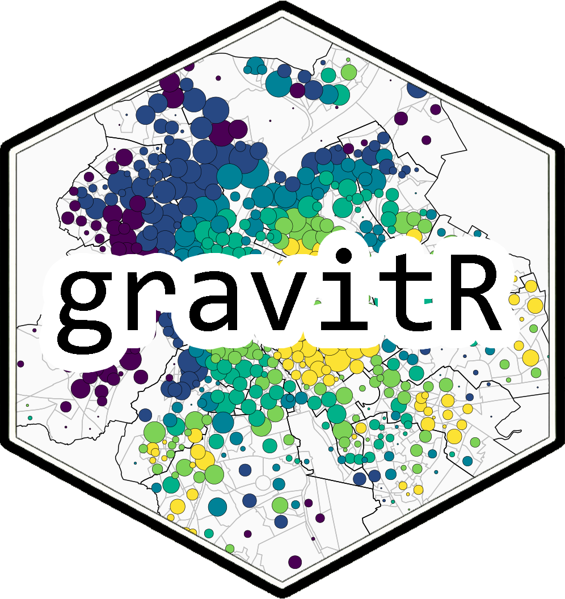

```{r, include = FALSE}
knitr::opts_chunk$set(
  collapse = TRUE,
  comment = "#>"
)
```


# gravitR

`gravitR` implements gravity-based allocation models using the Furness convergence algorithm to estimate interactions between demand locations and service providers. The package is particularly suited to the study of accessibility to public services and collective amenities, including childcare, education, healthcare, and sports facilities.

By combining distance-decay effects with capacity constraints and competition between users, `gravitR` produces accessibility indicators that can be used to measure spatial inequalities in access to services and facilities. These indicators reflect both proximity and service saturation, providing a more realistic assessment of territorial equity and supporting evidence-based planning and policy making.

## Installation

``` r
# Install devtools if necessary
install.packages("devtools")

# Install gravitr
devtools::install_github("ULB-IGEAT/gravitr")
```


```{r, message=FALSE}
  
library(gravitr)
library(dplyr)
library(sf)
library(mapsf)
library(phacochr)
library(gravitr)

```

## Why a simple ratio map is not enough

A simple ratio map compares the number of childcare places with the number of children in each spatial unit. This is easy to read, but it assumes that demand is only served locally. This is a strong limitation, especially in dense urban areas where families may use childcare outside their own sector. In addition, the ratio cannot be calculated in areas with no resident population, even though childcare facilities may be located there and serve neighbouring areas.

```{r,message=FALSE,warning=FALSE}
data(ratio_map)

communes_bxl <- phacochr::phaco_data("communes_bxl")

mf_map(ratio_map, col = NA, border = "grey")
mf_map(communes_bxl, col = NA, border = "black", add = TRUE)

mf_map(
  ratio_map,
  var = c("supply_sector", "ratio"),
  type = "prop_choro",
  pal = "Viridis",
  nbreaks = 5,
  inches = 0.08,
  leg_title = c("Childcare places", "Places per 100 children"),
  leg_pos = c("topright", "topleft"),
  border = "black",
  lwd = 0.3,
  add = TRUE
)

mf_layout(
  title = "Local ratio of childcare places to children",
  credits = "IGEAT-ULB, 2026.",
  arrow = FALSE,
  frame = TRUE
)
```

## Gravity-based allocation

The gravity model allocates demand to supply locations according to supply capacity, demand levels, and travel distance. Initial interactions are estimated using a gravity function:

$$
I_{ij} = \frac{S_i * D_j}{d_{ij}^{2}}
$$

where \(S_i\) is the supply, \(D_j\) is the demand, and \(d_{ij}\) is the distance between demand and supply locations.

The Furness algorithm then iteratively adjusts these interactions so that total allocated demand matches available supply while satisfying demand constraints. The resulting allocation reflects both competition for limited resources and travel distance, producing an accessibility measure that accounts for service saturation and spatial separation between users and facilities.

```{r,message=FALSE, warning=FALSE}
distance_matrix <- distance_matrix(
  supply = supply,
  demand = demand,
  min_distance = 400
)

allocation <- gravity(
  supply = supply,
  demand = demand,
  distance_matrix = distance_matrix,
  distance_power = 2,
  max_iter = 100,
  delta = 0.001,
  verbose = FALSE
)
```

## Mean distance from demand locations

The resulting allocation can be used to calculate the average travel distance from each demand location. In the case of population-based analyses, this indicator can be mapped for each statistical sector.

High average distances generally indicate a local shortage of supply relative to demand. Residents in these areas must travel further to access services because nearby facilities are insufficient or already saturated. Mapping average distances therefore provides a simple way to identify spatial inequalities in accessibility and areas where additional capacity may be needed.

```{r,message=FALSE,warning=FALSE}
sec_bxl <- phacochr::phaco_data("sec_bxl")

demand_map <- sec_bxl |>
  left_join(allocation$demand, by = c("cd_sector2024" = "id"))

supply_sf <- allocation$supply |>
  st_as_sf(coords = c("x", "y"), crs = 31370)

mf_map(demand_map, col = NA, border = "grey")
mf_map(communes_bxl, col = NA, border = "black", add = TRUE)

mf_map(
  demand_map,
  var = c("demand", "mean_distance"),
  type = "prop_choro",
  pal = "Viridis",
  nbreaks = 6,
  inches = 0.09,
  leg_title = c("Children", "Mean distance"),
  leg_pos = c("topright", "topleft"),
  border = "black",
  lwd = 0.3,
  add = TRUE
)

mf_map(
  supply_sf,
  type = "prop",
  var = "supply",
  inches = 0.04,
  col = "red",
  leg_title = "Childcare capacity",
  leg_pos = "left",
  border = NA,
  add = TRUE
)

mf_layout(
  title = "Mean distance from demand locations",
  credits = "IGEAT-ULB, 2026.",
  arrow = FALSE,
  frame = TRUE
)
```


## Authors

Institute for Environmental Management and Land-Use Planning (IGEAT), Université libre de Bruxelles (ULB).

</a> <a href="https://gag.sciences.ulb.be/">

</a></center>

## Other packages

### phacochr

Geocoding and spatial analysis tools for Belgium.

</a> <a href="https://phacochr.github.io/phacochr">

</a></center>
